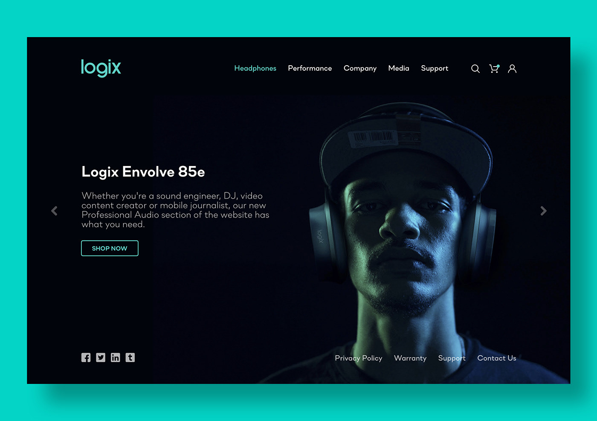

[Voltar à tela inicial](../../README.md)

### A seguinte tela deve ser feita com HTML e CSS puros.

> Você terá uma estrutura da seguinte forma:
```text
container
├── header
│   ├── logo
│   └── menu
│       ├── páginas
│       └── configurações
├── corpo
│   ├── título
│   ├── subtítulo
│   └── botão
└─ rodapé
    ├── menu social
    └── páginas
```